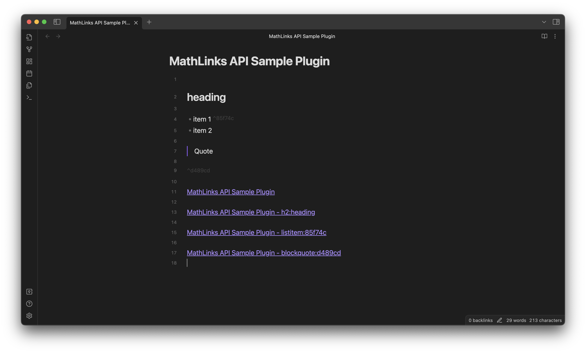
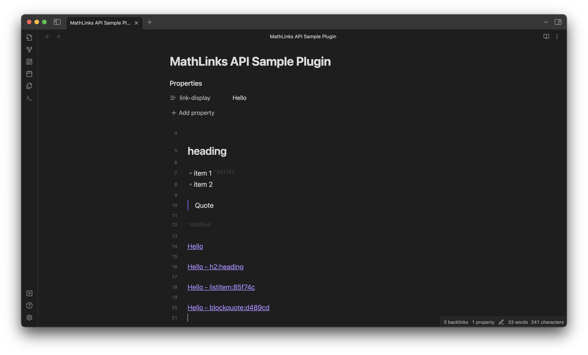

# Sample Plugin for Obsidian MathLinks API 

This is a sample [Obsidian.md](https://obsidian.md) plugin for demonstrating the usage of [MathLinks](https://github.com/zhaoshenzhai/obsidian-mathlinks) API.

**MathLinks** is a community plugin that renders MathJax in your links.
However, its power is not limited to math. Essentially, it can be used to
- change how a link is displayed
- _(planned)_ using arbitrary inline markdown formatting syntaxes supported by Obsidian (see [here](https://help.obsidian.md/Editing+and+formatting/Basic+formatting+syntax) and [here](https://help.obsidian.md/Editing+and+formatting/Advanced+formatting+syntax#Math))
	- Currently, only inline math is supported, but support for other syntaxes will also come soon.
- without actually touching your note's content (e.g. typing an alias for each link), as well as dynamically update the displayed contents.

**MathLinks API** is here with you to allow other community plugins to utilize this power! 
This repository contains a sample plugin that displays a link to a heading/block like this:



Moreover, if the note's property contains a certain key that the user defines in the plugin's setting tab (`link-display` by default), the note title in the links will be replaced with the corresponding property value:



> [!WARNING]
> This plugin uses currently unreleased APIs.


## Usage

In this section, I will walk you through the process of building a simple plugin using MathLinks API. 

### Installation

```
$ npm i -D obsidian-mathlinks
```

### Import

```ts
import { Provider, addProvider } from 'obsidian-mathlinks';
```

### Implement a custom provider

Given a pre-processed information of a link, `Provider` determines how the link is displayed through its `provide` method.

Let's take a link `[[Note#heading]]` as an example.
In this case, the "pre-processed information" contains:

- `parsedLinktext: { path: string, subpath: string }` - `{ path: 'Note', subpath: '#heading' }`
- `targetFile: TFile | null ` - [TFile](https://docs.obsidian.md/Reference/TypeScript+API/TFile/TFile)  object for `Note.md` if the link path `Note` is successfully resolved, `null` otherwise
- `targetSubpathResult: HeadingSubpathResult | BlockSubpathResult | null`  - The heading's information given by [resolveSubpath](https://docs.obsidian.md/Reference/TypeScript+API/resolveSubpath)
- `sourceFile: TFile` - [TFile](https://docs.obsidian.md/Reference/TypeScript+API/TFile/TFile)  object for the note where this link is stored in

To implement your custom provider, define a subclass of `Provider` and implement its `provide` method. It should return
- `string` that will be interpreted as a markdown source for the link's displayed text
	- in the near future, arbitrary inline markdown syntaxes such as `**bold**`/`$math$` will be allowed. But currently, only inline math is supported.
- or `null` when your provider doesn't want to provide any custom displayed text. 
	- In other word, your provider will be ignored when returning `null`.

```ts
class MyProvider extends Provider {
	constructor(mathLinks: any, public plugin: MyPlugin) {
		super(mathLinks);
	}

	provide(
		parsedLinktext: { path: string, subpath: string },
		targetFile: TFile | null,
		targetSubpathResult: HeadingSubpathResult | BlockSubpathResult | null,
		sourceFile: TFile
	): string | null {

		const { app, settings } = this.plugin;
		const { path, subpath } = parsedLinktext;

		if (!targetFile) return null;

		const targetCache = app.metadataCache.getFileCache(targetFile);
		const noteTitleDisplay = targetCache?.frontmatter?.[settings.key] ?? targetFile.basename;
		
		if (typeof noteTitleDisplay != 'string') return null;

		if (targetSubpathResult?.type == 'heading') {
			return (path ? `${noteTitleDisplay} - ` : '')
				+ `h${targetSubpathResult.current.level}:${targetSubpathResult.current.heading}`;
		} else if (targetSubpathResult?.type == 'block') {
			const { id } = targetSubpathResult.block;
			let blockType = targetCache?.sections?.find(section => section.id == id)?.type;
			if (!blockType && targetCache?.listItems?.find(section => section.id == id)) {
				blockType = 'listitem';
			}
			blockType = blockType ?? 'block';
			return (path ? `${noteTitleDisplay} - ` : '')
				+ `${blockType}:${id}`;
		}

		return noteTitleDisplay;
	}
}
```

### Register your provider

In the `onload` method of your plugin, register your custom provider.

- `addProvider` function creates an instance of your provider class using the factory function passed as the second parameter, and then registers it to MathLinks. Finally, it returns the provider object.
	- You have accesss to the MathLinks plugin instance inside the factory function.
- In most cases, you will want to pass the resulting provider to `addChild` method of your plugin so that the provider will properly unloaded when your plugin gets disabled. Otherwise, you are responsible to manage its lifecycle.

```ts
export default class MyPlugin extends Plugin {
	async onload() {
        ...
		this.addChild(
			addProvider(this.app, (mathLinks: any) => new MyProvider(mathLinks, this))
		);		
        ...
	}
}
```

### Tell MathLinks to update the displayed text

Use `update(app: App, file?: TFile)` to inform MathLinks that it should update the display text of links.
If `file` is given, MathLinks will only update the notes affected by changes in that file.
Otherwise, MathLinks will update all notes currently open.

## Remarks

- The users of your plugin have to install not only your plugin but also MathLinks.
- A breaking change might be introduced in the future.
